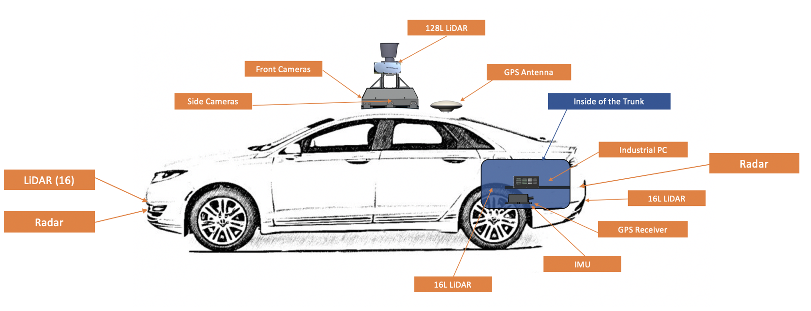

# Apollo

## Overview

* [Apollo](http://apollo.auto/) is a high performance, flexible architecture which accelerates the development, testing, and deployment of Autonomous Vehicles.[1]
* Apollo is loaded with new modules and features but needs to be calibrated and configured perfectly before you take it for a spin. Check the [github](https://github.com/ApolloAuto/apollo) for installation guide.

### Apollo 6.0

## Architecture
### Hardware Overview

### Hardware Connection

### Software Overview

---

### References

[1] : [ApolloAuto Github](https://github.com/ApolloAuto/apollo)   
[2] : [ApolloAuto Official](https://apollo.auto/)   
