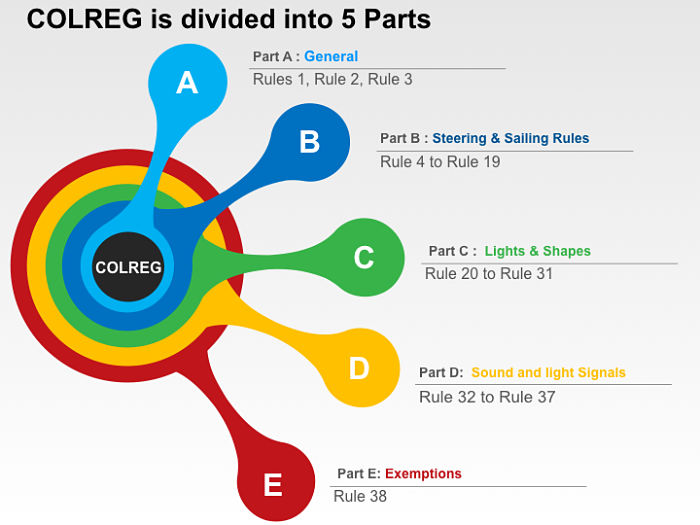
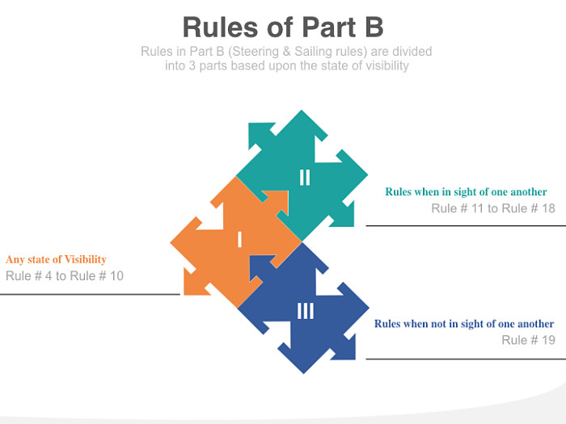
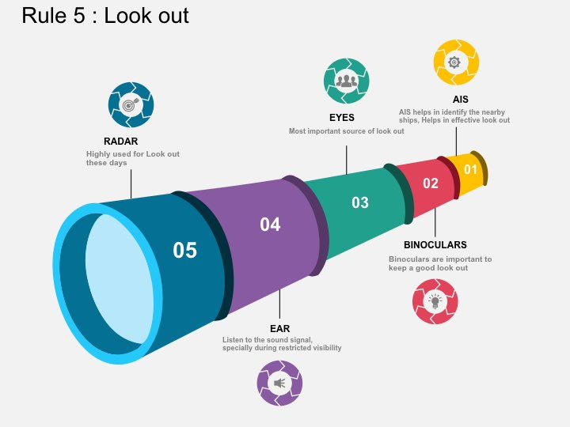
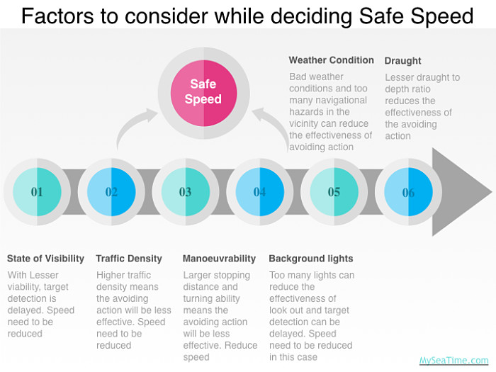
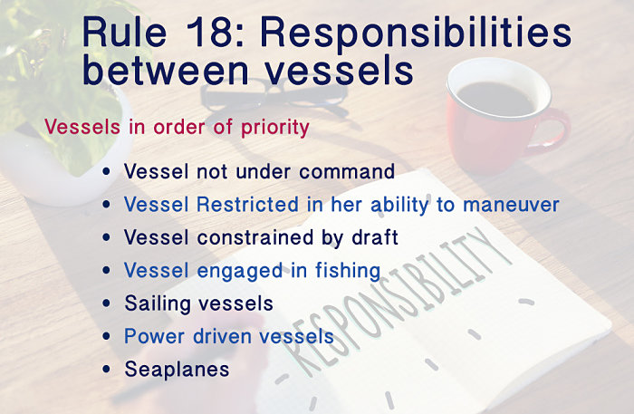
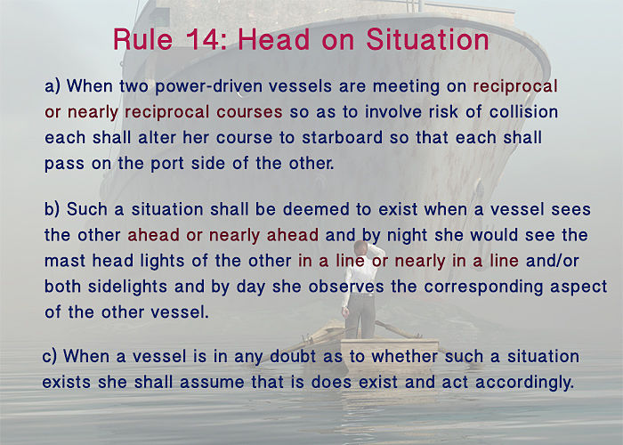
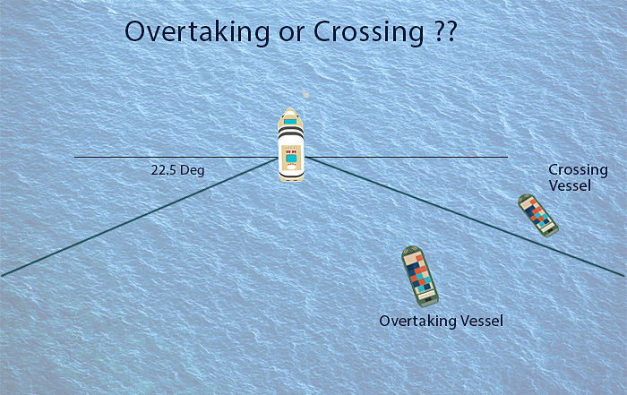

# International Regulations for Preventing Collisions at Sea
* International Regulations for Preventing Collisions at Sea 1972(COLREGs)
* published by the International Maritime Organization (IMO)
* "rules of the road" or navigation rules to be followed by ships and other vessels at sea to prevent collisions between two or more vessels[2]

## Brief[4]
Consists of 5 parts:
1. Part A: General
1. [Part B: Steering and sailing rules](<#Part-B:-Steering-and-sailing-rules>)
1. Part C: Light and shapes
1. Part D: Light and sound signals
1. Part E: Exceptions

### Part B: Steering and sailing rules
Divided into 3 parts based upon the state of visibility

#### Rule 5: Look out

#### Rule 7: Risk of collision[5]
1. Every vessel shall use all available means appropriate to the prevailing circumstances and conditions to determine if risk of collision exists. If there is any doubt such risk shall be deemed to exist.
1. Proper use shall be made of radar equipment if fitted and operational, including long-range scanning to obtain early warning of risk of collision and radar plotting or equivalent systematic observation of detected objects.
1. Assumptions shall not be made on the basis of scanty information, especially scanty radar information.
1. In determining if risk of collision exists the following considerations shall be among those taken into account:
	1. such risk shall be deemed to exist if the compass bearing of an approaching vessel does not appreciably change;
	1. such risk may sometimes exist even when an appreciable bearing change is evident, particularly when approaching a very large vessel or a tow or when approaching a vessel at close range.

#### Rule 6: Safe speed

#### Rule 18: Responsibility between vessels

#### Rule 15: Crossing situation
In a crossing situation with risk of collision, if you have a vessel on your starboard side, you are the give way vessel. In same situation if you have a vessel on your port side, you are the stand on vessel.

#### Rule 14: Head on situation

#### Rule 13: Overtaking situation

#### Rule 19: Restricted Visibility
1. Situation where target is detected by radar alone
	1. Target vessel forward of the beam.
		* alternation of course to port need to be avoided, other than vessel being overtaken
	1. Target vessel abeam or abaft the beam
		*  alternation of course towards the vessel need to be avoided
1. Situation where sound signal is heard
	* Watch keeper need to worry about the fog signal heard forward of the beam. In case a fog signal is heard forward of beam, we should reduce our speed. If we think that risk of collision still exists, we should reduce speed further upto where vessel can be kept on her course.

### References
[1] : [International Regulations for Preventing Collisions at Sea, Wikipedia](https://en.wikipedia.org/wiki/International_Regulations_for_Preventing_Collisions_at_Sea)   
[2] : [Convention on the International Regulations for Preventing Collisions at Sea, 1972 (COLREGs), archived](https://arquivo.pt/wayback/20091014023731/http://www.imo.org/Conventions/mainframe.asp?topic_id=257&doc_id=649)   
[3] : [COLREGs Rule Summary, IMO](https://www.imo.org/en/About/Conventions/Pages/COLREG.aspx)   
[4] : [8 COLREG rules every navigating officer must understand, MySeaTime](https://www.myseatime.com/blog/detail/8-colreg-rules-every-navigating-officer-must-understand)   
[5] : [COLREGS Rule 7: Risk of collision](https://www.nepia.com/media/73235/Colregs-Rule-07-Risk-of-Collision.PDF)   
[6] : [IRPCS Summary](http://www.soul-trade.com/sailing/dayskip/colregs_irpcs_summary_2_pages.pdf)