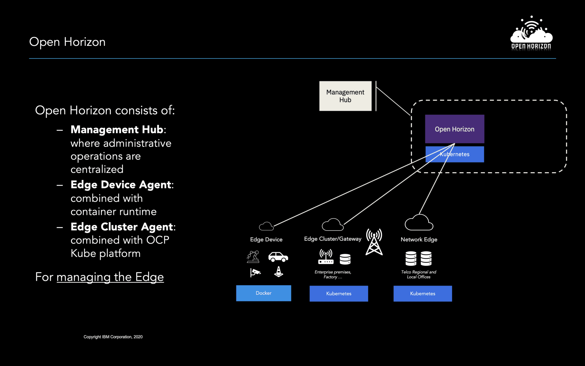
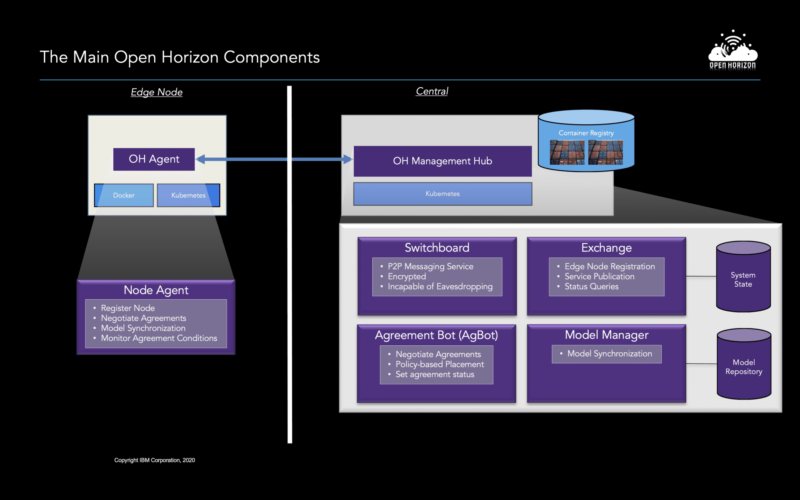

# Open Horizon

## Overview

* An LF Edge open-source project that provides remote and autonomous management of containerized applications and related models(including machine learning assets) that are deployed to distributed edge computing nodes and devices.[2]

* Open Horizon is a platform for managing the service software lifecycle of containerized workloads and related machine learning assets. It enables autonomous management of applications deployed to distributed webscale fleets of edge computing nodes and devices without requiring on-premise administrators.[1]

* Add new capabilities to a single-purpose device

* Enable your device to use other services (both nearby and cloud-based) to enhance its existing capabilities

* Automate the hands-free management of workload lifecycle on the device

* Automatically deploy applications to all devices where policies match and an agreement is negotiated

  

  

  

  

---

### References

[1] : https://www.lfedge.org/projects/openhorizon/    
[2] : https://developer.ibm.com/components/open-horizon/   
[3] : https://github.com/open-horizon/      
