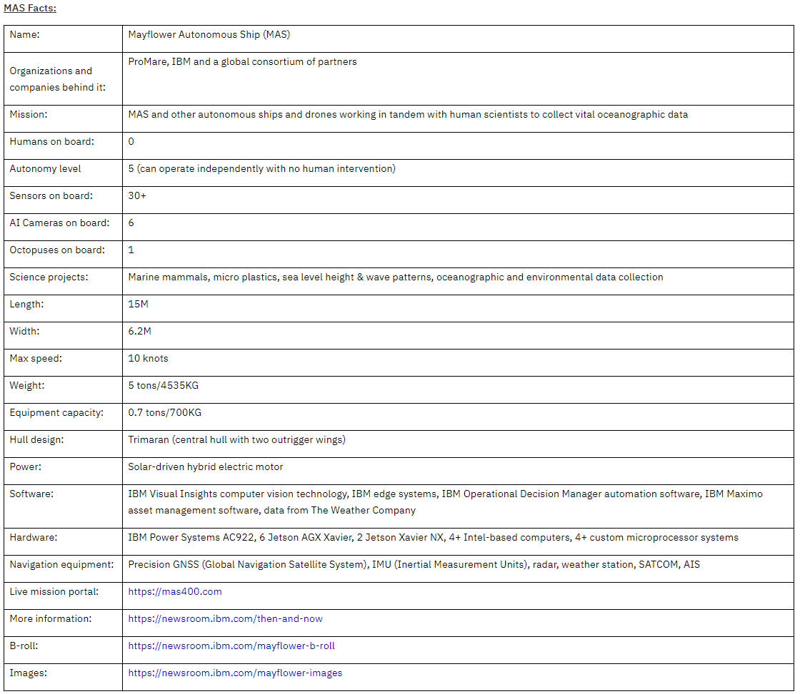
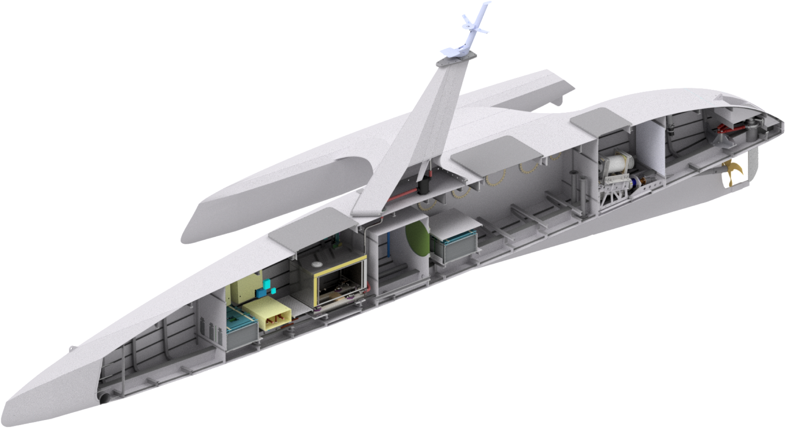

# Mayflower Autonomous Ship(MAS)
## Overview
* purpose : world's first full-sized, fully autonomous unmanned ship across the Atlantic Ocean
* Participant: Research organization ProMare, IBM + other partners
* Use IBM's AI, cloud, edge tech.
* Plymouth(England) -> Plymouth(MA, USA)
* Monday, April 19th, 2021
* first full-sized and fully autonomous vessels to cross the oceans?
* solar powered?
* aims  high degree of fault tolerance and be robust,light, mobile and able to operate completely autonomously

## Main Technology[2]
* 6 AI powered cameras
* 30 Onboard sensors
* 15 Edge devices

### Sensory Inputs
* Radar detects multiple hazards in MAS’s path, 2.5 nautical miles ahead.
* Onboard cameras provide visual input to an IBM computer vision system which identifies hazards like cargo ships, fishing vessels, and even partially submerged shipping containers floating in the water.
* Automatic Identification System (AIS) provides specific information about the other ship’s class, weight, speed, cargo, etc.
* GPS Navigation System provides MAS’s current location, heading, speed and course.
* MAS’s nautical chart server provides geospatial information about its chosen route.
* Weather data provided by The Weather Company.
* Attitude Sensors assess local sea state (how MAS pitches and rolls due to waves).
* Fathometer provides water depth measurements.
* Vehicle Management System provides operational data such as MAS’s battery charge level, power consumption, communications, science payloads etc.

### Realtime Analytics
* IBM Operational Decision Manager (ODM) evaluates COLREGs with respect to the other vessels in the vicinity and generates a risk map indicating an “unsafe” situation ahead.
* MAS’s AI Captain ingests the ODM recommendation, computer vision input, current and forecasted weather and assesses several options to avoid hazard.

### Decisions
* AI Captain determines the best action for MAS, in this hypothetical scenario, is to steer to starboard to avoid the unexpected navigation hazard.
* MAS’s Safety Manager verifies the decision is safe.
* AI Captain instructs MAS’s Vehicle Management system to change course and speed.

## Ship Specification[1]
### Ship Design
* Trimaran design giving it a low, highly stable and dynamic profile
* Made from aluminium and composite matereials, the Mayflower is very light weight:about 5 tonnes at 15meters long and 6.2meters wider. 

### Edge Computing Systems
* fully autonomous IBM edge computing system powered by serveral onboard NVIDIA Jetson AGX Xavier devices

### Machine Learning
* trained AI model using > 1 mil. nautical images from cameras in Plymouth + Open source database
* Uses IBM Power AC922 fuelled by IBM Power9 CPUs and NVIDIA V100 Tensor Core GPUs
* Uses IBM's computer vision tech. 

### AI Captain
* No human captain onboard crew
* The Mayflower Autonomous Ship is enabled by level-5 autonomy(an operate independently with no human intervention - especially important in the middle of the ocean where there is limited network connectivity)
* The AI Captain is designed to sense, think and make decisions independently.
* built by MarineAI based on number of IBM tech. including: IBM Visual Insights computer vision software, IBM Operational Decision Mananger automation software and IBM edge computing
* fuses data from MAS's onboard systems including radar, AIS, GPS, nautical charts, attitude sensors, fathometer, and Vehicle Management Systems + weather data

### Power Supply
* Lithium ion-phosphate batteries
* Solar Panels

### Cargo bay
* Modular cargo bay 
* Can hold up to 700kg

### Dual Motors
* Dual 20 kW permanaent magnet electirc propulsion motors
* producing less carbon than traditional diesel-burning engines

## Partners[4]
### Main
* Promare
* IBM

### Design/Construction
* MSubs
* Aluship
* MarineAI

### Equipment/Services
* Gard Marine
* Fisher Panda
* Teignbridge
* Wartsila
* Thales
* ExactEarth
* Veripos 
* Vodafone
* Silicon Sensing (Plymouth)
* Gill Instruments
* National Instruments
* Red Hat
* NVIDIA
* The Weather Company
* Rotec Hydraulics
* Kawasaki
* ChatBotBay
* IXBlue

### Research Partners
* Turnchapel Wharf
* Intellisense
* Valeport
* Chelsea Technologies
* iXSea
* RS Aqua
* Teledyne ISCO
* Plymouth Marine Lab
* Human Interface Technologies Team
* University of Plymouth
* Jupiter Research Foundation
* University of Liverpool
* University of Newcastle

### Reference
[1] : [Technology, Mayflower Autonomus Ship Official](https://mas400.com/technology)   
[2] : [Sea Trials Begin for Mayflower Autonomous Ship's 'AI Captain', IBM News Room](https://newsroom.ibm.com/2020-03-05-Sea-Trials-Begin-for-Mayflower-Autonomous-Ships-AI-Captain#assets_all)   
[3] : [Mayflower Autonomous Ship Launches, IBM News Room](https://newsroom.ibm.com/2020-09-15-Mayflower-Autonomous-Ship-Launches)   
[4] : [Partners, Mayflower Autonomus Ship Official](https://mas400.com/partners)
